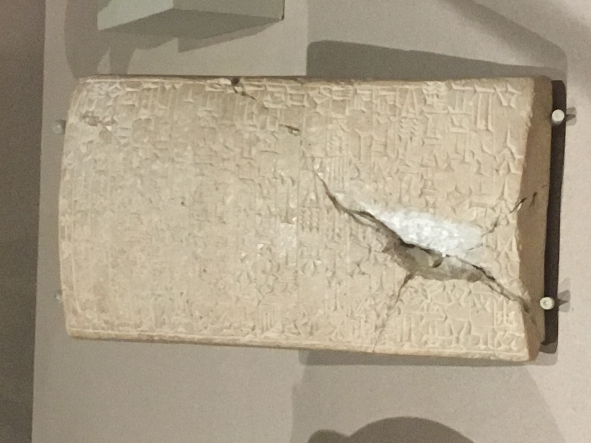
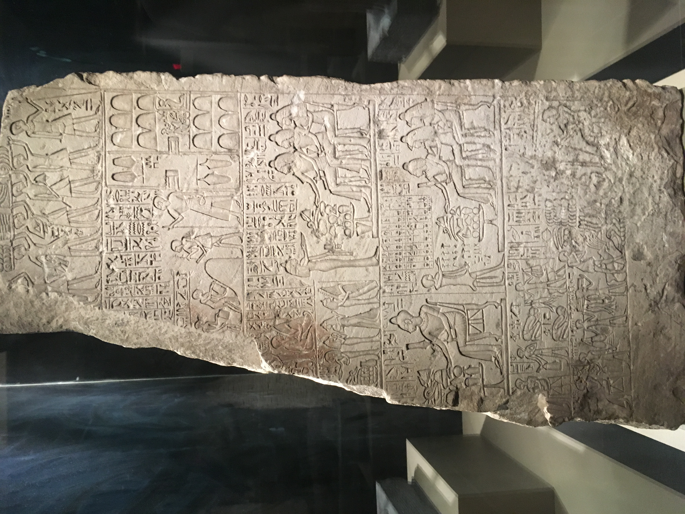
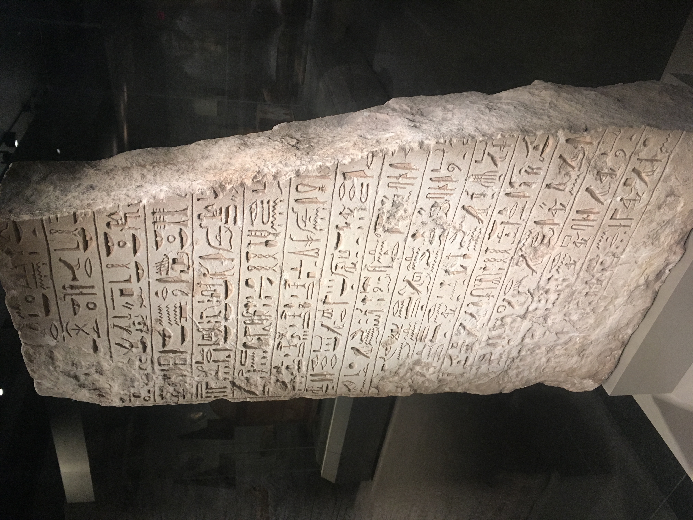

# Visible language

As we walk around the Ancient World Collections at the MFA, we were instructed to analyze the textual artifacts in front of us. Specifically, we were to think about the artifact's purpose and meaning. I began to think about how fascinating history of writing is and how the world evolved from these textual artifacts to the writing systems we have today.

## What is writing?

These are some definitions and functions of writing from "Visible Language: The Earliest Writing Systems" by Christopher Woods that really stood out to me and made me reconsider what writing is:
+ writing is a response of the rise of sociopolitical complexities
+ writing represents speech
+ writing is an extension of language used into areas where spoken language cannot do the job
  + ration accounts, records, labels, divination records, commemorative stelae

These all attempt to analyze the purpose and meaning of writing. As I think about the artifacts in front of me, I start by considering how the artifact attempts to define itself as writing.

## Foundation deposit in the form of a plano-convex brick

This foundation deposit is from Iraq during the Isin-Larsa Period under the reign of Warad-Sin from about 1834-1823 B.C. It is made of limestone with a flat bottom and a rounded top. When Warad-Sin rebuilt this building and dedicated the building to the goddess Nininsinna. From the translation provided, Warad-Sin hopes his "glory be extended to the distant future."

## Relief of the Royal Cup-Bearer Tjawy

 
This relief is from Egypt probably Thebes during the New Kingdom Dynasty 18 under the reign of Amenhotep III from 1390-1353 B.C. It is also made of limestone and is about 3 feet tall. This relief was served most likely as an architectural element in Tjawy's tomb. The front of the relief shows pictures and Egyptian symbols that were intended to provide the deceased with necessities in the next world. The back of the relief is a biographical inscription.

## Similarities

Both artifacts are made of limestone and both function as tools for remembrance - the foundation deposit will be discovered by later generations and those people will remember Warad-Sin and his "glory". As I walked through the exhibit at the MFA, I noticed that a majority of ancient textual artifacts were carved on limestone which suggests that limestone was more accessible and durable than other materials. The functions of these artifacts reiterated that writing emerged and survived due to its permanence. Both commissioners of the artifacts, likely Warad-Sin and Tjawy, are leaders of society
